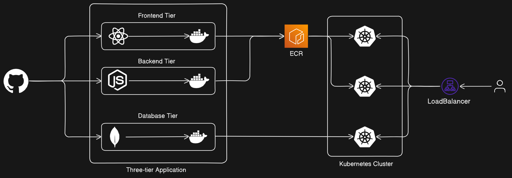

## Three-tier Application (Kubernetes)




## About
In a Kubernetes environment, each tier of the application can be containerized and deployed as pods, which are then managed and orchestrated by Kubernetes controllers like Deployments, StatefulSets, or DaemonSets. Kubernetes provides features for scaling, load balancing, and managing the lifecycle of these application components, making it suitable for hosting three-tier applications efficiently.
# Prerequisites

- Basic knowledge of Docker, and AWS services.
- An AWS account with necessary permissions.


## Application Code
The Application-Code directory contains the source code for the Three-Tier Web Application. Dive into this directory to explore the frontend and backend implementations.
## Kubernetes Manifests Files
The Kubernetes-Manifests-Files directory holds Kubernetes manifests for deploying your application on AWS EKS. Understand and customize these files to suit your project needs.
## Getting Started
To get started with this project, refer to our comprehensive guide that walks you through IAM user setup, EKS cluster creation, and more.

Step 1: IAM Configuration
- Create a user eks-admin with AdministratorAccess.
- Generate Security Credentials: Access Key and Secret Access Key.

Step 2: EC2 Setup
- Launch an Ubuntu instance in your favourite region (eg. region us-west-2).
- SSH into the instance from your local machine.


Step 3: Install AWS CLI v2

```bash
curl "https://awscli.amazonaws.com/awscli-exe-linux-x86_64.zip" -o "awscliv2.zip"
sudo apt install unzip
unzip awscliv2.zip
sudo ./aws/install -i /usr/local/aws-cli -b /usr/local/bin --update
aws configure
```
Step 4: Install Docker
```bash
sudo apt-get update
sudo apt install docker.io
docker ps
sudo chown $USER /var/run/docker.sock
```
Step 5: Install kubectl
```bash
curl -o kubectl https://amazon-eks.s3.us-west-2.amazonaws.com/1.19.6/2021-01-05/bin/linux/amd64/kubectl
chmod +x ./kubectl
sudo mv ./kubectl /usr/local/bin
kubectl version --short --client
```
Step 6: Install eksctl
```bash
curl --silent --location "https://github.com/weaveworks/eksctl/releases/latest/download/eksctl_$(uname -s)_amd64.tar.gz" | tar xz -C /tmp
sudo mv /tmp/eksctl /usr/local/bin
eksctl version
```
Step 7: Setup EKS Cluster
```bash
eksctl create cluster --name three-tier-cluster --region us-west-2 --node-type t2.medium --nodes-min 2 --nodes-max 2
aws eks update-kubeconfig --region us-west-2 --name three-tier-cluster
kubectl get nodes
```
Step 8: Run Manifests
```bash
kubectl create namespace workshop
kubectl apply -f .
kubectl delete -f .
```

    
## Contribution Guidelines
- Fork the repository and create your feature branch.
- Deploy the application, adding your creative enhancements.
- Ensure your code adheres to the project's style and contribution guidelines.
- Submit a Pull Request with a detailed description of your changes.
